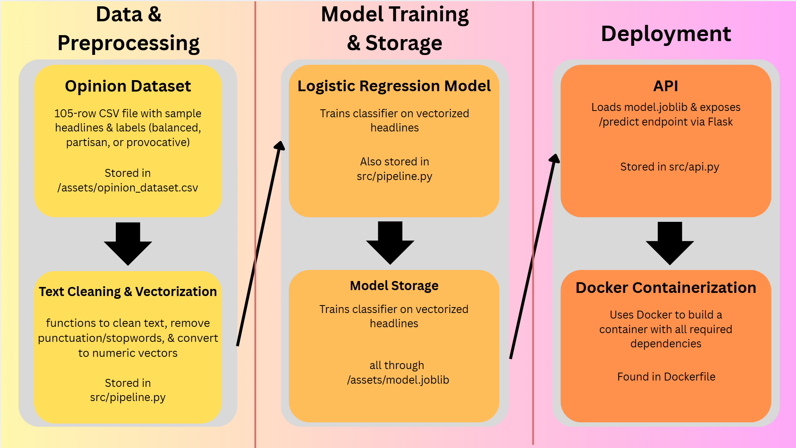

# Executive Summary:
As an opinion editor for UVA's newspaper, I regularly evaluate headlines not just for clarity but for tone, bias, and potential reader impact. This project builds a lightweight Bias Detector that automates part of that process by classifying opinion headlines into Balanced, Partisan, or Provocative categories. The tool is designed to help writers and editors become more aware of language that may inadvertently push a narrative or heighten polarization.
# System Overview:
## Course concepts
This project demonstrates bias classification by integrating multiple course concepts: it uses a data pipeline built with pandas for dataset loading and preprocessing, a machine learning pipeline with scikit-learn (TF-IDF vectorization + Logistic Regression) for training and evaluation, and a Flask API for serving predictions. The application is fully containerized using Docker, ensuring reproducibility and easy deployment.
## Architecture Diagram

## Data/Models/Services
The project uses a curated opinion dataset stored in assets/opinion_dataset.csv containing 105 labeled articles for training and testing the bias classifier. The CSV is in standard text format, roughly 7 KB in size, and does not have licensing restrictions as it was created for instructional purposes. The trained model is saved as assets/model.joblib, a binary file of about 20 KB that stores the TF-IDF vectorizer and Logistic Regression classifier pipeline. The model was trained locally using Python 3.11 with scikit-learn and pandas, and it is intended for educational and demonstration purposes only. All project services, including the API in src/api.py and containerization via the Dockerfile, are open-source and rely on permissively licensed Python libraries (Flask, joblib, scikit-learn, pandas).
#

